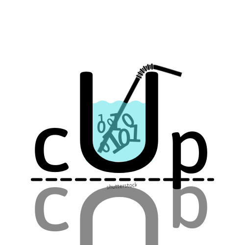

# CUP - NGÔN NGỮ LẬP TRÌNH CHO GIÁO DỤC + PHÁT TRIỂN! [](https://forthebadge.com)


Đây là triển khai của một ngôn ngữ lập trình thông dịch được viết và lấy cảm hứng từ [python](https://www.python.org/) cho các mục đích giáo dục, đào tạo và phát triển khoa học máy tính. Dưới đây là cái nhìn tổng quan về ngôn ngữ này:

### I. Dự án này bao gồm:

- [Lexer](https://github.com/ArtistEatCode/PyCup/blob/main/Cup/Cup/Lexer.py) sử dụng biểu thức chính quy ([regex](https://en.wikipedia.org/wiki/Regular_expression))
- [Parser](https://github.com/ArtistEatCode/PyCup/blob/main/Cup/Cup/Parser.py) sử dụng đệ quy từ trên xuống
- [Interpreter](https://github.com/ArtistEatCode/PyCup/blob/main/Cup/Cup/Interpreter.py) hoạt động theo nguyên tắc [AST](https://github.com/ArtistEatCode/PyCup/blob/main/Cup/Cup/AST.py)
- [REPL](https://github.com/ArtistEatCode/PyCup/blob/main/Cup/Cup/__main__.py) hỗ trợ chạy các lệnh trên cmd và các tệp riêng lẻ

### II. Mục tiêu của Cup:

| 1 |Toán Tử	|Mô tả			|Ví dụ																|
|:-:|:---:		|:---:			|:---:																|
|OK	|Arithmetic	|+, -, *, /, \\, %, ^, \|x\|, x!|1 + 2, 8 - 8, 5!, \|-12\|, ...						|
|OK	|Assignment	|=, :, x+, x- <br><br> +=, -=, *=, /=, \=, %=, ^=, &&=, \|\|=, ^^=|pi = 3.14, x = 100, friend: 'Hxngxd', cup: 'tea' <br><br> x+ (x = x + 1), y- (y = y - 1), x += y (x = x + y), ...							  |
|OK	|Comparison	|<, >, <=, >=, ==, !=, <=>, ><|0 < 1, 1 == 1, 1 <=> 'one', {1,2,3} >< {2,3,5}, ...	|
|OK	|Logical	|&, \|, !, and, or, not|true & false, me and you, eat\|cook, not null, ...			|
|OK	|Identity	|is , is not	|1 is true, 1 is not false, ...										|
|OK	|Membership	|in, not in	|1 in [1,2,3], 'man' not in ['male', 'female'], ...						|
|OK	|Bitwise	|&&, \|\|, ^^, <<, >>|1 && 1, 1 << 2, 0 ^^ 1, ...									|
|OK	|Others		|+a, -a, a?, ~a, //|+1, -3.14, true?, ~1, // comment line ...											|

| 2 |Kiểu dữ liệu|Ví dụ 											|
|:-:|:---:   	|:---:		 										|
|OK	|text		|"Cup", '123', "Speed run in \"25s\" !!!" ...		|
|OK	|integer   	|123, 100, 0, 1,  ...								|
|OK	|decimal   	|9.8, 10., .3, 0.0, ...								|
|OK |complex   	|i, 10i, 6.+5i, 12.3i, 10^2i ... 					|
|OK	|logic   	|true, false, null									|
|OK	|ordinal   	|'A' <-> 65, 'a' <-> 97, "Z" <-> 90, 'z' <-> 122 ...|
|OK	|bytes   	|not yet											|
|OK	|memory   	|not yet											|
|OK	|bytearr   	|not yet											|
|OK	|list   	|[1, '3', 4], [[1, true], [0, false], [-1, null]]...|
|OK	|set   		|{'C', 'U', 'P'}, {1, 2, 3, 4, 5, 6, 7, 8, 9}...	|
|OK	|shell   	|((1,2), (3,4)), (true, false, false)...			|
|OK	|range   	|[1;10], (0,5], [-oo; +oo], [100;10;2) ...			|
|OK	|map   		|{'Viet Nam':'Ha long', 'Gun':'AK-47'}, ...			|

| 3 |Từ Khóa	|Mô tả						|
|:-:|:---:		|:---:						|
|OK	|Condition	|if, elif, else, when, is 	|
|OK	|Loops		|for, in, while, else		|
|OK	|Exception	|do, unless, last			|
|OK	|Function	|let, function				|
|OK	|Class		|class						|
|OK	|Module		|use, as, of 				|
|OK	|Others		|return, quit, skip, ...	|

### III. Ví dụ về tìm kiếm nhị phân trong Cup:

```
let BinarySearch(array, low, high, key): // same as find() built-in function
	while low <= high:
		mid = low + (high - low)/2
		if array[mid] == key:
			return mid
		elif array[mid] > key:
			high = mid - 1
		else:
			low = mid + 1
	return -1

// init array, key
array = [1,2,3,4,5,6,7,8,9] 
key = read("Enter your key: ")

// find key in array
output = BinarySearch(array, 0, 8, integer(key))

// result
say(key + " found at: " + string(output))
```
Bạn có thể tìm thấy các ví dụ tại [đây](https://github.com/ArtistEatCode/PyCup/tree/main/Cup/Test)

### IV. Bắt đầu thế nào?

Trên màn hình Command Prompt (cmd), nhập các lệnh sau:

```
git clone https://github.com/ArtistEatCode/PyCup.git
cd Cup
python -m Cup Test/hello_world.cup
```

### V. Các cộng tác viên

<table>
  <tr>
	<td align="center">
		<a href="https://github.com/ArtistEatCode">
			
			<br/>
			<sub>
				<b>ArtistEatCode</b>
			</sub>
		</a>
		<br/>
		<a href="https://github.com/ArtistEatCode/PyCup/commits/main" title="Code">💻</a>
		<a href="https://github.com/ArtistEatCode/PyCup/pulls" title="Reviewed Pull Requests">👀</a>
	</td>
	<td align="center">
		<a href="https://github.com/hxngxd">
			
			<br/>
			<sub>
				<b>hxngxd</b>
			</sub>
		</a>
		<br/>
		<a href="https://github.com/hxngxd/hxngxd.github.io/pulls" title="Reviewed Pull Requests">👀</a>	
	</td>
  </tr>
</table>

Bất kỳ sự đóng góp nào đều được hoan nghênh và chào đón bởi [tôi](https://github.com/ArtistEatCode/AboutMe.git). Kiểm tra phần **Issues** để xem các vấn đề còn tồn tại hoặc nộp hồ sơ của riêng bạn!

Tạo kho lưu trữ này là một cách tuyệt vời để đóng góp vào mã làm cho ngôn ngữ ngày một hoàn thiện hơn! Tạo một yêu cầu kéo (tốt nhất là cho nhánh phát triển) nếu bạn có bất kỳ thứ gì cần thêm và nó sẽ được xem qua.
